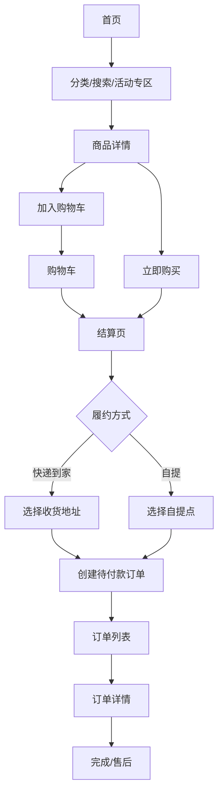
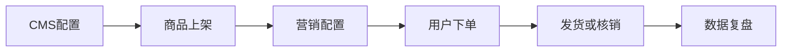

# 页面流程图

```mermaid
flowchart TD
  A[首页] --> B[分类/搜索/活动专区]
  B --> C[商品详情]
  C --> D[加入购物车]
  C --> E[立即购买]
  D --> F[购物车]
  F --> G[结算页]
  E --> G
  G --> H{履约方式}
  H -->|快递到家| I[选择收货地址]
  H -->|自提| J[选择自提点]
  I --> K[创建待付款订单]
  J --> K
  K --> L[订单列表]
  L --> M[订单详情]
  M --> N[完成/售后]
```

## 后台运营流程

```mermaid
flowchart LR
  A[CMS配置] --> B[商品上架]
  B --> C[营销配置]
  C --> D[用户下单]
  D --> E[发货或核销]
  E --> F[数据复盘]
```
