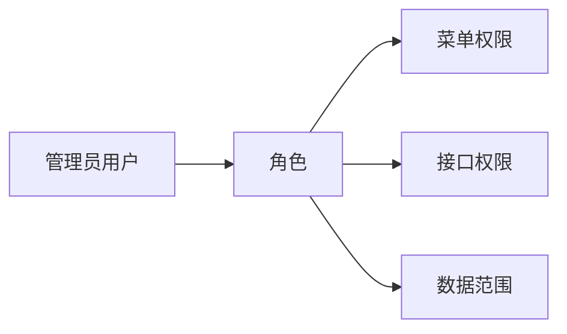

# 权限架构设计

## 角色

- 超级管理员
- 运营管理员
- 商品管理员
- 客服管理员
- 财务管理员
- 仓库管理员

## 模型

采用标准 RBAC 模型：

```mermaid
flowchart LR
  U[管理员用户] --> R[角色]
  R --> M[菜单权限]
  R --> P[接口权限]
  R --> D[数据范围]
```

## 菜单分组

- 仪表盘
- 商品中心
- 订单中心
- 会员中心
- 营销中心
- CMS配置
- 自提点管理
- 系统设置
- 权限管理
