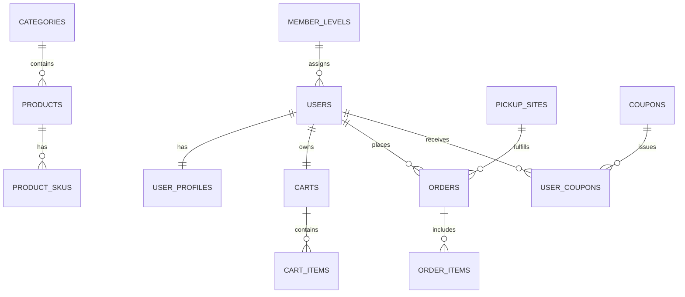

# 数据库设计

## ER 关系图

## 核心表

### users

| 字段 | 类型 | 说明 | 索引 |
| --- | --- | --- | --- |
| id | bigint | 主键 | PK |
| mobile | varchar(20) | 手机号 | UK |
| nickname | varchar(64) | 昵称 |  |
| member_level_id | bigint | 会员等级 | IDX |
| points | int | 积分 |  |
| growth_value | int | 成长值 |  |
| status | tinyint | 状态 | IDX |

### products

| 字段 | 类型 | 说明 | 索引 |
| --- | --- | --- | --- |
| id | bigint | 主键 | PK |
| category_id | bigint | 分类ID | IDX |
| name | varchar(128) | 商品名 | IDX |
| price_cents | int | 销售价 |  |
| member_price_cents | int | 会员价 |  |
| stock | int | 总库存 |  |
| sales_count | int | 销量 |  |
| status | tinyint | 上下架状态 | IDX |

### orders

| 字段 | 类型 | 说明 | 索引 |
| --- | --- | --- | --- |
| id | bigint | 主键 | PK |
| order_no | varchar(32) | 订单号 | UK |
| user_id | bigint | 用户ID | IDX |
| fulfillment_mode | varchar(16) | 履约方式 | IDX |
| pickup_site_id | bigint | 自提点ID | IDX |
| total_amount_cents | int | 订单金额 |  |
| discount_amount_cents | int | 优惠金额 |  |
| payable_amount_cents | int | 应付金额 |  |
| status | varchar(16) | 状态 | IDX |

## 索引设计原则

- 手机号、订单号、券码使用唯一索引
- 状态字段与时间字段组合索引用于后台筛选
- 商品分类、自提点、会员等级使用普通索引
- 热点营销活动状态通过 Redis 加速
